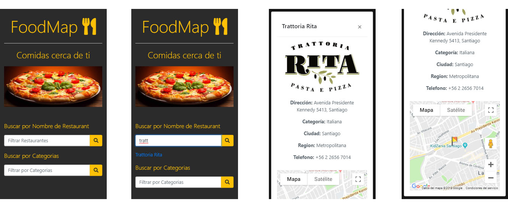

FoodMap es una aplicación mobile que permite buscar restaurantes cerca de tu ubicación

Proyecto realizado para Laboratoria

## Tecnología usada

* HTML5
* CSS3
* Bootstrap
* Javascript ECM6
* Google api maps

## Vistas

## Intrucciones de uso

*  Ingresa a la aplicación.
*  Ingrese nombre del restaurante que busca o por categorias.
*  Obtenga el resultado de búsqueda

## Enlace deploy

https://valepm0511.github.io/FoodMap/.
